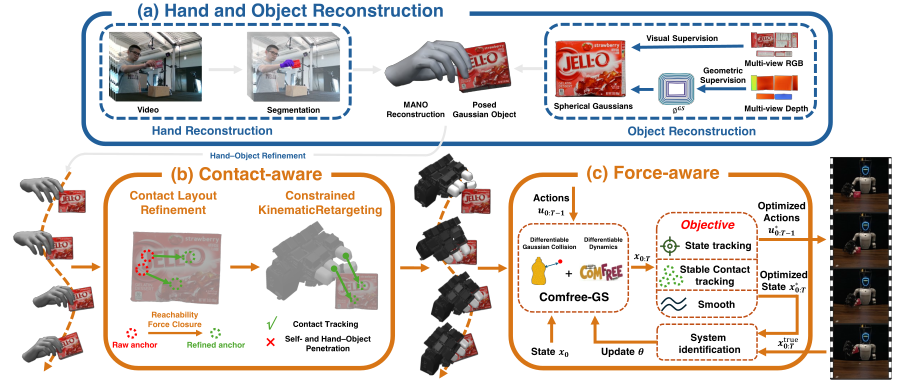

# DexForge

**High-Fidelity Physics-Informed Dexterous Retargeting**

[Meizhong Wang](https://scholar.google.com/citations?hl=zh-CN&user=oElJeMUAAAAJ), [Ruiqi Ni](https://ruiqini.github.io/), [Kun Cao](https://ntu-caokun.github.io/), [Lihua Xie](https://personal.ntu.edu.sg/elhxie/), [Yiguang Hong](https://scholar.google.com/citations?user=QUTN3IwAAAAJ&hl=zh-CN)

[](docs/assets/pipeline.svg)

[Project Page](https://wmz1226.github.io/DexForge/)

This repository contains the **retargeting component** of DexForge. It converts
prepared MANO hand-object demonstrations into robot hand trajectories and
actuator targets through two stages:

- **ContactAware (CA):** kinematic retargeting and contact refinement.
- **ForceAware (FA):** dynamics optimization using CA trajectories and guidance.

Both stages share the bundled ComFree-Warp simulator, which supports mesh and
Gaussian sphere (GS) geometry with hard or soft contact modes.

## Setup

Requires Linux, Python 3.10, an NVIDIA GPU, EGL, and a C++ compiler.

```bash
git clone https://github.com/wmz1226/DexForge.git
cd DexForge
bash setup.sh
source .venv/bin/activate
```

Download the required MANO model into `assets/mano/` following its
[setup instructions](assets/mano/README.md). Model files are not included.
An existing compatible Python environment can also be used. `setup.sh` accepts
`DEXFORGE_PYTHON` and `DEXFORGE_VENV` to select the interpreter and environment.

## Quickstart

Run ContactAware followed by ForceAware on the included Sugar Box sequence with
LEAP Hand:

```bash
python run_example.py --scene gs --mode hard
```

Use `--scene mesh` for mesh geometry and `--mode soft` for soft contact. These
options can be combined; all four configurations use the same settings across
both stages. The first run compiles GPU kernels.

Results are saved to `results/<scene>_<mode>/<sequence>/`:

| Result | Path within the output directory |
|---|---|
| ContactAware video | `contactaware/retarget.mp4` |
| ForceAware video | `forceaware/rollout.mp4` |
| ForceAware metrics | `forceaware/metrics.json` |
| Wall time for each stage | `timings.json` |

The runner copies the input sequence before processing it. For another run,
choose a new `--output-dir /path/to/result`. Use `--sequence-dir /path/to/sequence`
and `--hand leaphand` for your own [prepared inputs](contactaware/README.md#inputs),
or `--mano-models /path/to/models` for externally stored MANO models.

## Documentation

- [ContactAware](contactaware/README.md): input formats, kinematic retargeting, and contact guidance.
- [ForceAware](forceaware/README.md): dynamics optimization, configuration, outputs, and replay.
- [Simulator collision API](forceaware/third_party/comfree_warp/comfree_warp/geometry/README.md): mesh/GS queries, contact modes, and gradients.

## License

Original project code is released under the [MIT License](LICENSE). Bundled
third-party software and example data retain their own licenses, including the
ComFree Core Academic Research License; see [third-party notices](THIRD_PARTY_NOTICES.md).
